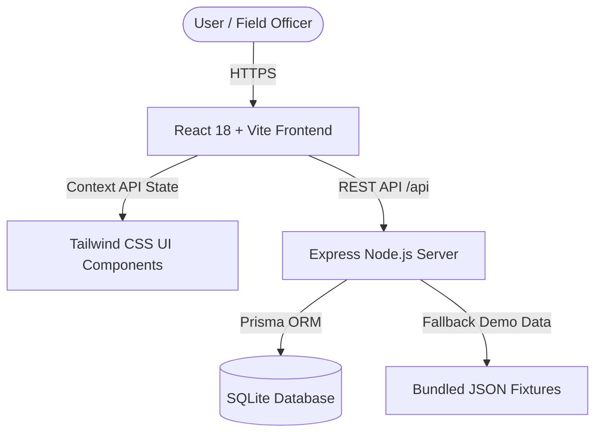

# 🗺️ NER-Saarthi (North East Region Saarthi)

> **AI-Powered Logistics & Route Accessibility Intelligence Platform**  
> *Ministry of Development of North Eastern Region (DoNER) • Government of India*

[](LICENSE)
[](https://reactjs.org/)
[](https://www.typescriptlang.org/)
[](https://tailwindcss.com/)
[](https://expressjs.com/)
[](https://www.prisma.io/)

---

## 📌 Table of Contents
- [About the Project](#-about-the-project)
- [Key Features](#-key-features)
- [System Architecture](#-system-architecture)
- [Tech Stack](#-tech-stack)
- [Getting Started](#-getting-started)
  - [Prerequisites](#prerequisites)
  - [Installation & Setup](#installation--setup)
  - [Running the Application](#running-the-application)
- [API Endpoints](#-api-endpoints)
- [Database & Prisma Seeding](#-database--prisma-seeding)
- [Environment Variables](#-environment-variables)
- [Production Build & Deployment](#-production-build--deployment)
- [License](#-license)

---

## 🌟 About the Project

**NER-Saarthi** is an integrated command and accessibility intelligence platform engineered specifically for the North Eastern Region of India under the aegis of the **Ministry of DoNER**.

The unique topographical realities of Northeast India—ranging from high-altitude mountain passes and monsoonal soil erosion to frequent landslide hazards—demand an intelligent, resilient logistics monitoring solution. **NER-Saarthi** unifies ground officer reports, route hazard sensors, fleet telemetry, and predictive AI analytics into a real-time operational command center across all 8 Northeast states: **Assam, Meghalaya, Arunachal Pradesh, Tripura, Mizoram, Nagaland, Manipur, and Sikkim**.

---

## 🚀 Key Features

### 1. 🛡️ Command Dashboard & Interactive Hazard Map
- **Live Leaflet Mapping**: Real-time visualization of 25+ critical highway corridors color-coded by risk index (`Clear`, `At-Risk`, `Blocked`).
- **Simulated Terrain Hazards**: Interactive triggers for simulating landslides, monsoon downpours, and convoy delays with real-time polyline color updates.
- **Emergency Alert Banner**: Pulsing alert notifications for critical road closures and weather hazards.

### 2. 📍 Route Intelligence & Risk Engine
- **Corridor Monitoring**: Deep metrics on landslide probability, rainfall intensity, visibility distance, and historical hazard trends.
- **Assigned Officer Desk**: Direct link to the designated officer supervising each route sector.

### 3. 🚚 AI Logistics Planner
- **Smart Dispatch Optimization**: Predictive algorithms calculate risk-adjusted ETAs, delivery reliability scores, and cost-effective convoy routing.
- **Cargo Type Scoping**: Specialized handling for essential consignments (medical supplies, food grains, agri-produce, and construction material).

### 4. 👮 Authenticated Field Officer Network
- **Dynamic Session Handling**: Real-time display of the authenticated officer's **Full Name**, **Role**, **Department/Organization**, and a green **Active/Online** status indicator.
- **Officer Profile Drawer**: Slide-out profile showing official ID, assigned sector, GPS coordinates (`lat`, `lng`), control room hotline, and latest field observation report.
- **Field Report Submission**: Instant submission of on-ground observations directly linked to Prisma SQLite database.

### 5. 📊 Analytics & CSV Reports Export
- **Historical Trends & Audits**: Bar charts and risk distribution breakdowns powered by Recharts.
- **CSV Data Export**: One-click export for operational reports and audit logs.

### 6. 🌐 Multi-Lingual & Regional Integration
- **Regional Language Support**: Support for English, Hindi, Assamese, Manipuri, and Bengali.
- **Explore Northeast**: Tourism, state highlights, cultural festivals, and live regional news RSS feeds.

---

## 🏗️ System Architecture



---

## 💻 Tech Stack

### Frontend
- **Framework**: React 18 (TypeScript) + Vite
- **Styling**: Tailwind CSS, Vanilla CSS Glassmorphic Design System
- **Mapping**: Leaflet, React-Leaflet
- **Charts & Data**: Recharts
- **Icons**: Lucide React

### Backend
- **Server**: Node.js, Express.js
- **ORM**: Prisma ORM
- **Database**: SQLite
- **Runtime**: tsx / ts-node

---

## 🛠️ Getting Started

### Prerequisites
Make sure you have Node.js and npm installed:
- **Node.js**: `v18.0.0` or higher
- **npm**: `v9.0.0` or higher

### Installation & Setup

1. **Clone the Repository**:
   ```bash
   git clone https://github.com/Pranya15/NER-Sarthi.git
   cd NER-Sarthi
   ```

2. **Install Root & Server Dependencies**:
   ```bash
   npm install
   npm --prefix server install
   ```

3. **Initialize & Seed the Database**:
   ```bash
   npm --prefix server run db:push
   npm --prefix server run db:seed
   ```

---

## 🏃 Running the Application

### Development Mode (Simultaneous Frontend & Backend)

1. **Start the Express API Server** (runs on port `5000`):
   ```bash
   npm run dev:server
   ```

2. **Start the Vite Frontend** (runs on port `3000`):
   ```bash
   npm run dev
   ```

3. Open **[http://localhost:3000](http://localhost:3000)** in your browser.

---

## 🔌 API Endpoints

The Express backend exposes the following RESTful API endpoints at `http://localhost:5000/api`:

| Method | Endpoint | Description |
| :--- | :--- | :--- |
| `GET` | `/api/health` | Health check endpoint |
| `GET` | `/api/routes` | Fetch all route segments & coordinates |
| `GET` | `/api/officers` | Fetch all registered field officers |
| `GET` | `/api/vehicles` | Fetch logistics convoy fleet status |
| `GET` | `/api/field-reports` | Fetch all submitted field reports |
| `POST` | `/api/field-reports` | Submit a new field observation report |

---

## 🗄️ Database & Prisma Commands

Commands run inside the `server/` directory:

```bash
# Push schema changes to SQLite database
npm --prefix server run db:push

# Seed database with operational fixtures
npm --prefix server run db:seed

# Regenerate Prisma Client
npm --prefix server run db:generate
```

---

## 🔑 Environment Variables

### Root (`.env`)
```env
VITE_API_URL=/api
```

### Server (`server/.env`)
```env
PORT=5000
HOST=0.0.0.0
DATABASE_URL="file:./dev.db"
```

---

## 📦 Production Build & Deployment

To build and run the full stack production bundle:

```bash
# Build both frontend & backend
npm run build:all

# Start production server on port 5000
npm start
```

---

## 📄 License

Distributed under the MIT License. See `LICENSE` for more details.

---

<p align="center">
  <b>Ministry of Development of North Eastern Region (DoNER) • Government of India</b>
</p>
